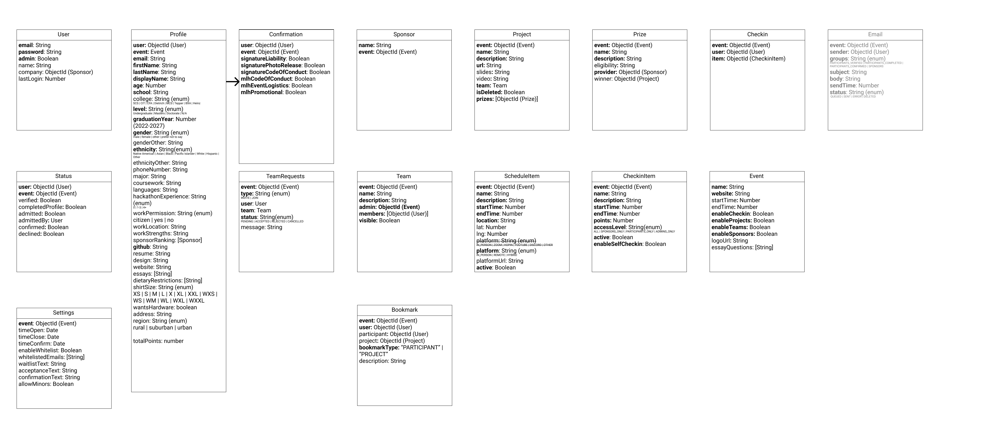

# TartanHacks Backend

This is the backend system for the TartanHacks software suite. 

## Getting Started

1. Copy `template.env` as a separate file called `.env`
2. Fill in the environment secrets as needed in that file
3. Run `npm install` to install packages
4. Run `npm run build`
5. Run `npm run dev` to run the project in dev mode.
6. See the swagger endpoint documentation by visiting `/docs`

## Database Model

## Environment
If you need to create any new environment variables, add an example to `.env.template`
and make sure to add it as well to `.github/workflows/main.yml` so that CI
passes

## Emails
In order to configure a new email template, create a folder under `email-templates`.
In that folder, create your [mjml](https://documentation.mjml.io/) templates. Also,
create a file called `index.ts` which exports the rendered html by calling
[mjml2html](https://documentation.mjml.io/#inside-node-js) on your template file
and indexing on the `html` field. See `email-templates/verification` for an example.
In `email-templates/index.ts`, make sure to include your folder in the default
export so that the email service can detect your newly added template.

## Style
Please install [Prettier](https://marketplace.visualstudio.com/items?itemName=esbenp.prettier-vscode)
in your VS Code workspace. The workspace has configuration files for helping
you adhere to the project style guidelines. Before commits, please make sure
that your code is formatted correctly by running `npm run lint`

## Testing
We are using Jest for testing.

For any functions or endpoints you write, please write the appropriate tests
in the `tests` folder. Before committing, please make sure that all tests
pass.

We also have CI configured through GitHub actions. These will show you if your
commit builds and passes all tests.

## Code coverage
To view code coverage, run `npm run coverage`